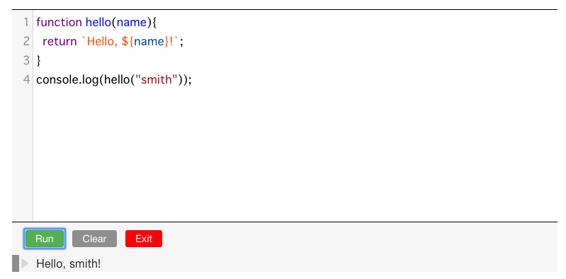

# codemirror-console 

codemirror-console provide Web Console UI for JavaScript.

## Features

- Eval code and Show the result
- Provide Web Console UI that is similar with Browser's developer tools
- Editor([CodeMirror 5](https://codemirror.net/5/))

## Demo

- <https://codemirror-console.netlify.com/>

## Packages

If you want to get Web Console UI, please use [codemirror-console-ui](./packages/codemirror-console-ui).

- [codemirror-console](./packages/codemirror-console)
    - Core library that wrap [CodeMirror](https://codemirror.net/)
- [codemirror-console-ui](./packages/codemirror-console-ui)
    - UI components
- [gitbook-plugin-js-console](./packages/gitbook-plugin-js-console)
    - UI components and directive for [gitbook](https://github.com/GitbookIO/gitbook)

## UseCase

We develop these libraries for web book.

Interactive Web Console help you to learn JavaScript Language.

- [jsprimer.net](https://jsprimer.net/ "この書籍について · JavaScriptの入門書 #jsprimer")
    - Source: [asciidwango/js-primer](https://github.com/asciidwango/js-primer "asciidwango/js-primer: JavaScriptの入門書")
- [JavaScript Promiseの本](http://azu.github.io/promises-book/ "JavaScript Promiseの本")
    - Source: [azu/promises-book](https://github.com/azu/promises-book/ "azu/promises-book: JavaScript Promiseの本")

If you have used this library, please add it to the "UseCase".

Welcome to Pull Request!

## Developments

This monorepo use [Yarn](http://yarnpkg.com/).

Installation

    yarn install
    yarn bootstrap

Build all

    yarn run build
    
Run Tests

    yarn test
    
## Contributing

1. Fork it!
2. Create your feature branch: `git checkout -b my-new-feature`
3. Commit your changes: `git commit -am 'Add some feature'`
4. Push to the branch: `git push origin my-new-feature`
5. Submit a pull request :D

## License

MIT
